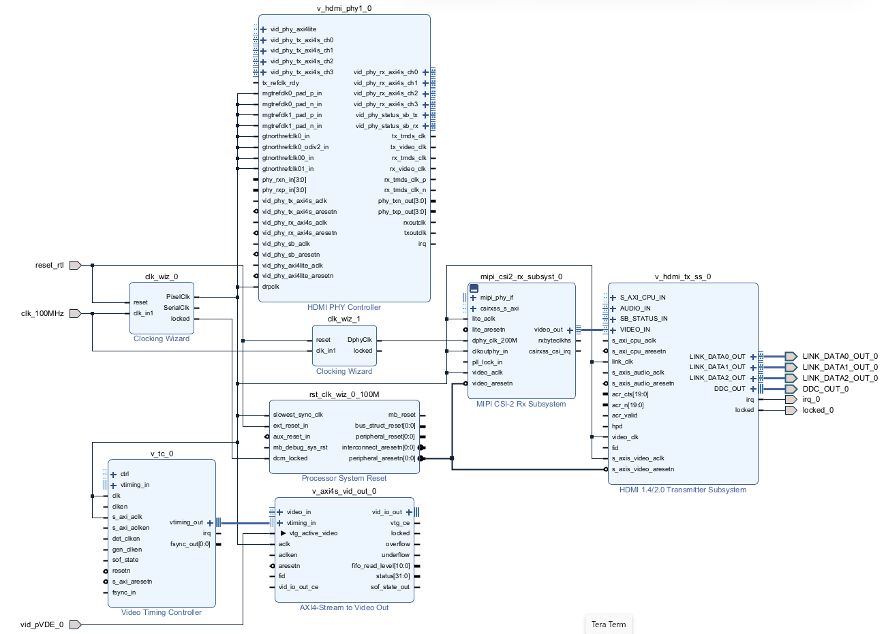

[Fork from kria-vitis-platforms](https://github.com/amahpour/kria-vitis-platforms)

[How to Use AI on the KV260 Vision Kit for Human Face Detection
](https://youtu.be/L_Zd9R4ZeiI?si=G9S9et0T9VdsqUI5)

[Vitis Platform Flow Example: Adding a Raspberry Pi Camera to SmartCam’s Platform](https://xilinx.github.io/kria-apps-docs/creating_applications/2022.1/build/html/docs/vitis_platform_flow_smartcam_raspi_example.html)

[Build Vitis Platform](https://xilinx.github.io/kria-apps-docs/kv260/2022.1/build/html/docs/build_vitis_platform.html)

[Smart Camera](https://xilinx.github.io/kria-apps-docs/kv260/2022.1/build/html/docs/smartcamera/smartcamera_landing.html)

