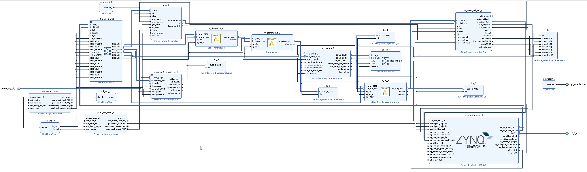

[Chat GPT Disscussion](https://chatgpt.com/share/6a7d7c4d-ab30-83ea-af17-f740bde66227)

New Repository Reference: Vivado 2021.2 [IMX219 MIPI sensor 1080p/30fps video to Ultra96-V2/Kria KV260 FPGA DisplayPort](https://github.com/gtaylormb/ultra96v2_imx219_to_displayport)

Official Board setting tutorial: Vivado 2022.1 [Setting Up the Board and Application Deployment](https://xilinx.github.io/kria-apps-docs/kv260/2022.1/build/html/docs/smartcamera/docs/app_deployment.html)

Youtube Tutorials: 

[How to Use AI on the KV260 Vision Kit for Human Face Detection
](https://www.youtube.com/watch?v=L_Zd9R4ZeiI)

[Getting Started with the Kria KV260 Vision AI Starter Kit
](https://youtu.be/N6UBuat8f2U?si=L8LSZgemRcPo3rlt)

